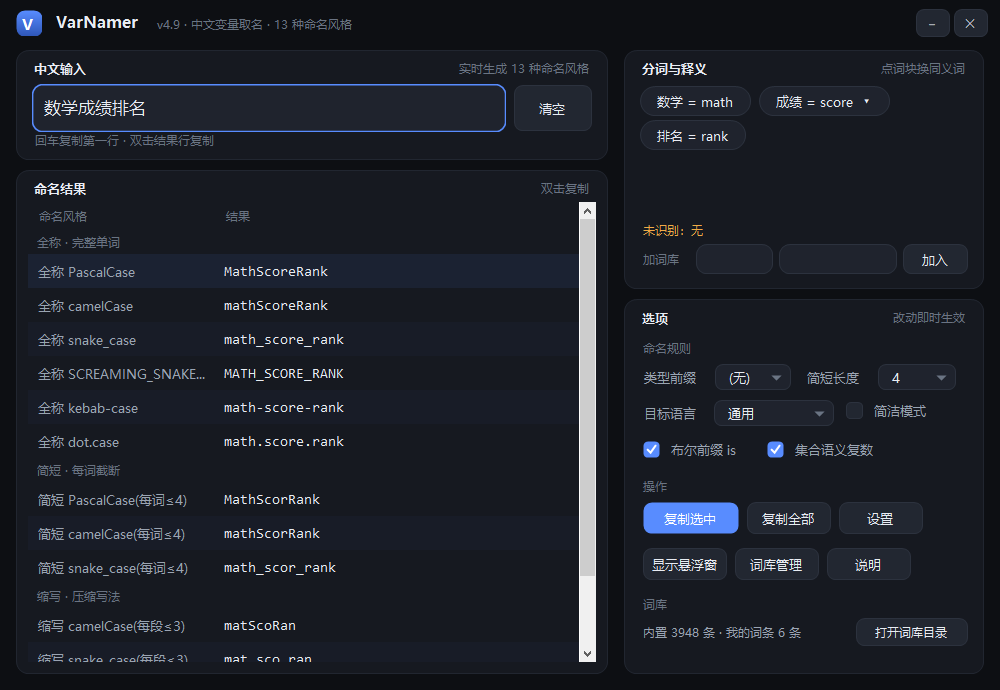
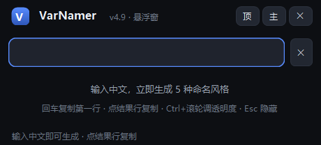
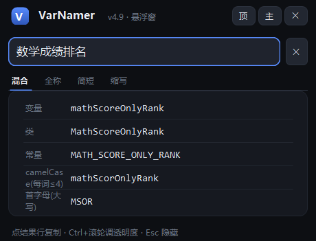

# VarNamer · 中文变量取名

> 输入中文，直接得到符合团队规范的英文变量名；附带微信风格的截图标注工具。
> 单文件 exe，**免安装、免运行时、免联网**（用 Windows 自带的 .NET Framework 4.x）。




---

## 这是什么

写代码时经常卡在取名：`数学成绩` 到底写 `mathScore`、`math_score` 还是 `MathScore`？
VarNamer 让你输入中文，**实时得到 13 种命名风格**，点一下即可复制，不用再切浏览器查词。

- 一个 exe，双击就能用，不写注册表、不装运行库
- 内置 3948 条中英词库（IT / 数据 / 网络 / 业务 / 金融 / 教育 / 医疗 …）
- 带一个全局热键悬浮窗：在编辑器里按一下就能取名，复制完自动切回编辑器
- 附送截图标注（微信风格：矩形 / 箭头 / 画笔 / 高亮 / 马赛克 / 文字 / 钉在桌面）

## 下载

到 [Releases](https://github.com/NoxdevDong/VarNamer/releases) 页面下载（**不要**直接 clone 仓库，仓库里没有编译好的 exe）：

| 版本 | 文件 | 说明 |
|---|---|---|
| 便携版 | `VarNamer-Portable-v5.3.zip` | 解压到任意目录（含 U 盘），双击 `VarNamer.exe` 即用；配置与词库都写在同目录，删文件夹即彻底卸载 |
| 安装版 | `VarNamer-Setup-v5.3.exe` | 图形安装向导，装到当前用户目录（**不需要管理员权限**），带开始菜单/桌面快捷方式、开机自启、卸载项 |

两个版本功能完全一致。系统要求：**Windows 10 / 11**（自带 .NET Framework 4.x），无需联网。

想直接用源码：

```bash
git clone https://github.com/NoxdevDong/VarNamer.git
```

## 功能

### 命名引擎

输入「数学成绩」得到 13 种风格：

| 分组 | 风格 |
|---|---|
| 全称 | `PascalCase`、`camelCase`、`snake_case`、`SCREAMING_SNAKE_CASE`、`kebab-case`、`dot.case` |
| 简短 | 每词截断到 3~6 字的 Pascal / camel / snake |
| 缩写 | 每段≤3 / 首字母大小写 |

- **最长匹配分词**：`缓存命中率` 会切成 `缓存 + 命中率`，而不是逐字拆
- **布尔前缀**：`是否激活` → `isActivate`
- **集合复数**：`所有学生` → `students`
- **类型前缀**：可选 `str` / `int` / `arr` … 一键加前缀
- **中英双向**：输入中文出英文变量名；输入**纯英文**会额外给一行「中文」反查结果（score → 分数 / 总分 / 成绩…），悬浮窗与主界面都有
- **中英混排**：`中文夹杂 abc 端口` → `chineseAbcPort`（英文原样保留）
- **8 个语言预设**：通用 / Java / C# / Python / JavaScript / TypeScript / Go / C / C++ / SQL / CSS —— 选 Python 就给 `snake_case`，选 Java 就给 `camelCase`
- **简洁模式**：新手只显示「变量名 / 类名 / 常量名」三行

### 悬浮窗

| 空输入（只有一条输入框） | 有结果（5 行） |
|---|---|
|  |  |

- 默认**半透明**不挡视线：点一下窗口 / 开始输入 → 全亮，点到别处自动恢复半透明
- 顶部风格切换条：**混合 / 全称 / 简短 / 缩写**，窗口高度自适应
- 结果行**依次亮起**，点行 = 复制，回车 = 复制第一行
- 默认热键 `Ctrl+Alt+V`：唤起悬浮窗并自动转换剪贴板里的中文
- `Ctrl+滚轮` 调透明度、`Esc` 隐藏、拖动移动、位置记忆

### 截图标注

`Ctrl+Alt+A` 唤起：拖选区域（可调 8 个手柄、可移动、可重选）→ 矩形 / 椭圆 / 箭头 / 画笔 / 高亮 / 马赛克 / 文字 → 复制 / 保存 / **钉在桌面**（等比缩放、滚轮缩放、Ctrl+滚轮调透明度）。

### 词库

- **内置 3948 条**，编译期内嵌在 exe 里，打开就能用，**不需要任何导入操作**
- **自动检测导入**：把词库 `.txt` 丢进程序目录的 `dict` 文件夹（文件名随便起），程序启动自动并入；也可以在「词库管理 → 检测本地词库」手动触发
- **只做加法**：与内置重复的条目不重复写入，你自己改过的定义永不被覆盖
- 词库管理分三个标签页：**词条**（搜索 / 增删 / 双击载入）、**导入导出**（检测 / 导入导出 txt / 备份恢复 / 打开词库目录）、**在线翻译**（可选，默认关闭）
- 未命中的字自动记入 `dict\unknowns.txt`（和词库文件放在一起，方便顺手补齐；该目录不可写时自动改用用户数据目录）
- 支持一键备份/恢复（`.vnbak`，含配置 + 词库）

### 界面与交互

- 深色 / 浅色主题（Fluent 2 配色令牌 + Material 3 状态层）
- 12 处微动效：窗口淡入、结果行依次亮起、按钮悬停渐变、复制行高亮闪动、状态文字自动淡出
- 悬浮窗、主界面、词库管理三处共用同一套下划线式标签条
- 主界面「说明」里带作者署名与 GitHub 跳转入口（点一下用浏览器打开项目主页）

## 快速开始

| 想做的事 | 怎么做 |
|---|---|
| 中文 → 变量名 | 输入中文，**左键双击结果行**复制（回车复制第一行） |
| 在编辑器里取名 | 复制中文 → `Ctrl+Alt+V` → 点结果行 → 自动切回编辑器 → `Ctrl+V` |
| 截图标注 | `Ctrl+Alt+A` → 拖选 → 标注 → 复制 / 保存 / 钉桌面 |
| 改设置 | 托盘图标右键 → 设置（热键 / 主题 / 开机自启 / 悬浮窗透明度） |
| 退出 | 托盘图标右键 → 退出（关窗口只是最小化到托盘） |

命令行（可选）：

```bat
VarNamer.exe --copy 数学成绩 --style snake --out result.txt   :: 转换并写剪贴板
VarNamer.exe --trhelp                                        :: 导出在线翻译使用说明
```

## 从源码构建

只需要 **Windows 自带的 .NET Framework 编译器**（`csc.exe`），不需要 Visual Studio、不需要联网、不需要任何 SDK 或包管理器：

```powershell
powershell -ExecutionPolicy Bypass -File build.ps1      # 编译主程序 + 跑引擎自检
powershell -ExecutionPolicy Bypass -File package.ps1    # 产出便携版 zip + 安装版 exe
powershell -ExecutionPolicy Bypass -File tools\check.ps1  # 跑回归套件（54 项）
```

> 源码是 C# 5 语法（因为用的是系统自带的老编译器）：不能用字符串插值、`nameof`、表达式体成员。

### 目录结构

```
src/          30 个 .cs（取名引擎 / 主题与自绘控件 / 各窗口 / 截图 / 词库）
data/         内置词库（编译期内嵌为资源）
dict/         可编辑的全量词库（会打进两个发布包，供自动导入）
assets/       程序图标（tools/make_icon.cs 生成）
tools/        安装器 / 卸载器 / 图标生成 / 回归套件
build.ps1     编译（主程序 + 自检）
package.ps1   打包（便携版 + 安装版）
```

## 设计说明

界面数值取自官方设计令牌，不是随手定的：

| 来源 | 许可 | 用到的部分 |
|---|---|---|
| [microsoft/fluentui](https://github.com/microsoft/fluentui) `tokens/src/global` | MIT | 间距阶梯（4/8/12/16/20/24）、圆角（8/12/16）、时长（100/200/250ms）、曲线（decelerateMax / accelerateMax / easyEase）、字号阶梯 |
| [material-components/material-web](https://github.com/material-components/material-web) `_md-sys-state` | Apache-2.0 | 状态层不透明度（hover 8% / focus 12% / pressed 12%） |

只使用了**设计数值**，没有拷贝第三方代码；曲线求值（cubic-bezier 二分求解）为自写实现。

## 开发

仓库带一个回归套件（`tools/suite.cs`，54 项），覆盖：取名引擎、选项开关、词库覆盖语义、配置读写往返、各窗体的按钮接线、托盘菜单、悬浮窗状态机与风格组、动效曲线端点、**布局重叠检测**、**控件裁切检测**。

```powershell
powershell -ExecutionPolicy Bypass -File tools\check.ps1
```

## 常见问题

**Q：双击没反应？**
A：程序是单实例，可能已经在运行 —— 看右下角托盘区。

**Q：热键和别的软件冲突？**
A：主界面 → 选项 → 热键，录一个新组合即可。

**Q：便携版卸载？**
A：删掉整个文件夹。数据都在同目录 `VarNamerData` 里，不写系统盘、不写注册表。

**Q：安装版的数据在哪？**
A：`%APPDATA%\VarNamer\`。覆盖安装/升级不会丢；要清空就删这个文件夹（卸载时也可勾选一并删除）。

**Q：词库不够用？**
A：把任意 `.txt`（格式 `中文=英文`）丢进程序目录的 `dict` 文件夹，重启即自动导入；或在词库管理里手动加。

**Q：会联网吗？**
A：不会。只有你自己开启「在线翻译」并填了平台密钥，才会在词库没命中时请求翻译接口。

**Q：支持 macOS / Linux？**
A：不支持。用的是 .NET Framework 4.x + WinForms。

## 更新日志

见 [CHANGELOG.md](CHANGELOG.md)。

## 许可

[MIT](LICENSE)。可自由用于个人与商业项目，保留版权声明即可。

## 免责声明

本工具只在你本机对**本地文本**做转换与截图，不上传任何数据。截图功能作用于你自己的屏幕内容，请自行确认所截内容不涉及他人隐私或敏感信息。

---

## 作者

[@NoxdevDong](https://github.com/NoxdevDong)　·　欢迎提 issue 与 PR
